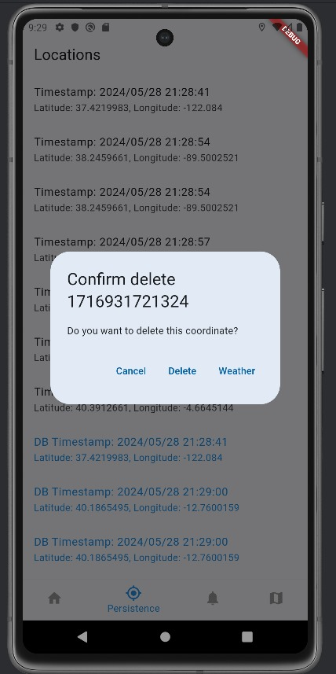

# MADVerSusFlutter

## Workspace 
Github:  
- Repository: https://github.com/miriamvisus/MADVerSusFlutter
- Releases: https://github.com/miriamvisus/MADVerSusFlutter/releases

Workspace: https://upm365.sharepoint.com/sites/MADclavervisus/SitePages/Tracking.aspx
  

## Description
This Flutter/Dart-based app is a university project aiming to integrate Open Street Maps (https://www.openstreetmap.org/) and OpenWeatherMaps (https://openweathermap.org/) for providing mapping and weather services.

### Objectives
- **Open Street Maps Integration**: To utilize Open Street Maps for comprehensive mapping functionalities.
- **OpenWeatherMaps Integration**: To incorporate weather forecasting features using the OpenWeatherMaps API.
- 
## Screenshots and navigation /  TEMP
<table>
  <tr>
    <td>
      
      
Login Screen

    </td>
    <td>
      
      
Main View

    </td>
  </tr>
  <tr>
    <td>
      
      
UID Authentication

    </td>
    <td>
      
      
Coordinates list

    </td>
  </tr>
  <tr>
    <td>
      
      
Coordinates can be deleted

    </td>
    <td>
      
      
Coordinates can be updated

    </td>
  </tr>
  <tr>
    <td>
      
      
You can check your login and log out in the settings screen

    </td>
    <td>
      
      
To access the map you are asked about your location

    </td>
  </tr>
  <tr>
    <td>
      
      
Then the map screen is shown with a predefined route

    </td>
    <td>
      
      
You can also check the weather of a location

    </td>
  </tr>
  <tr>
    <td>
      
      
This is the Feedback zone

    </td>
    <td>
      
      
And you can leave us a review!

    </td>
  </tr>
</table>

## Demo Video

## Features
- Login and Logout.
- Shows the weather of a location with a distinguised UI.
- Interactive map.
- Real-time coordiate management.
- Our special mesones route

List of **technical** features of the app.
- Libraries versions:
  fluttertoast: ^8.0.8
  shared_preferences: ^2.2.2
  firebase_core: ^2.30.1
  firebase_auth: ^4.19.4
  firebase_database: ^10.5.4
  http: ^1.2.1
  geolocator: ^11.0.0
  flutter_map: ^6.1.0
  latlong2: ^0.9.0
  path_provider: ^2.1.3
  csv: ^6.0.0
  intl: ^0.19.0
  logger: ^2.2.0
  sqflite: ^2.0.0+4
  cupertino_icons: ^1.0.6
  firebase_storage: ^11.7.5
  font_awesome_flutter: ^10.7.0
  firebase_messaging: ^14.9.2
  flutter_native_splash: ^2.4.0
  provider: ^6.1.2
  flutter_bloc: ^8.1.5
  flutter_launcher_icons: ^0.13.1

  flutter packages to download: https://pub.dev/
  flutter official documentation: https://flutter.dev/development
  
- Maps: Openstreetmaps or Google maps
- Resful APIs used (https://openweathermap.org/api .Weather related API). 
- Persistence in database
- Persistence in shared preferences
- Firebase Realtime database
- Firebase authentication
  
## How to Use
The app is very straightforward, just press the enter button to enter to the main view and then you decide next
Would you like to go to the setting? Just press the setting button!!!
Would you like to go to check all your saved coordinates? Just press the Collection button, you can also check its weather too!!!
Perhaps you would like to go to the main point? Just press the Map button, it also shows you a route of our best mesones!!!
Or maybe you want to leave us a review!!

## Participants
List of MAD developers:
- Sergio Claver (sergio.fclaver@alumunos.upm.es)
- Miriam Visús (miriam.visus.martin@alumunos.upm.es)   
